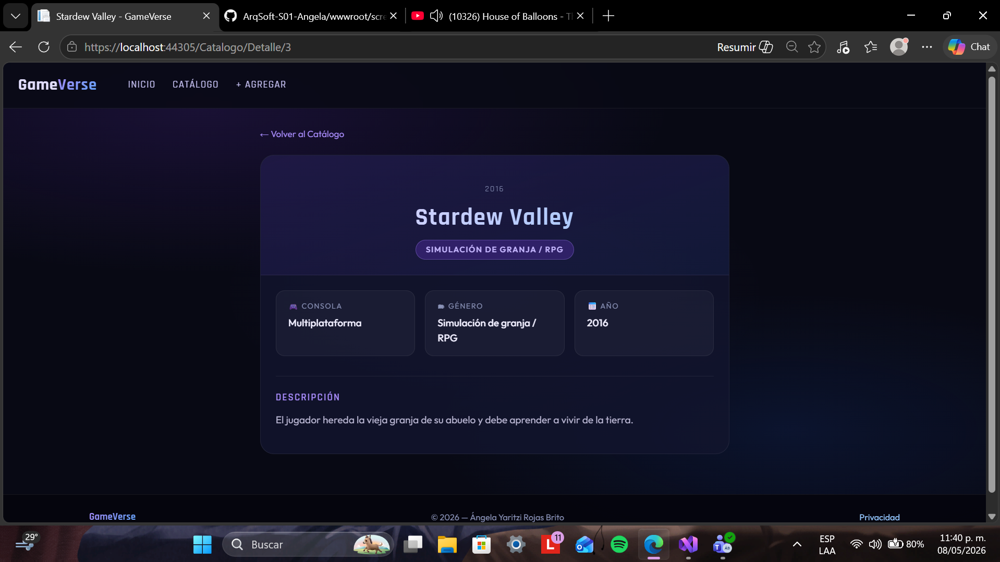

# Catalogo de videojuegos - GameVerse 

Aplicación para administrar tu colección personal de videojuegos. Puedes ver tu catálogo, consultar el detalle de cada juego y agregar nuevos títulos de tus juegos preferidos.

## Tecnologías usadas

- ASP.NET Core MVC
- C#
- HTML / CSS / JavaScript

## Capturas de pantalla

### Inicio

### Catálogo

### Detalle de videojuego

### Agregar videojuego

