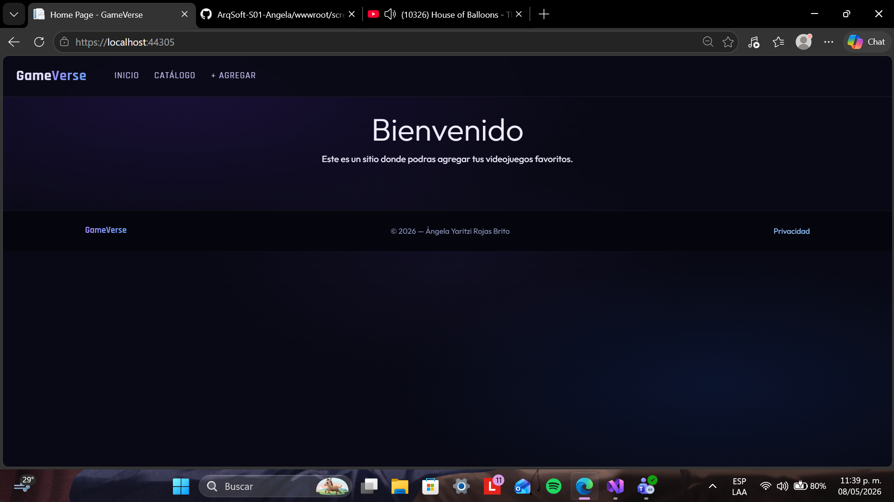
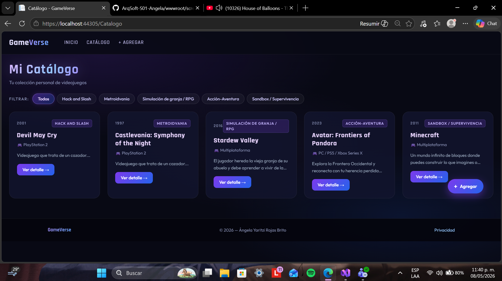
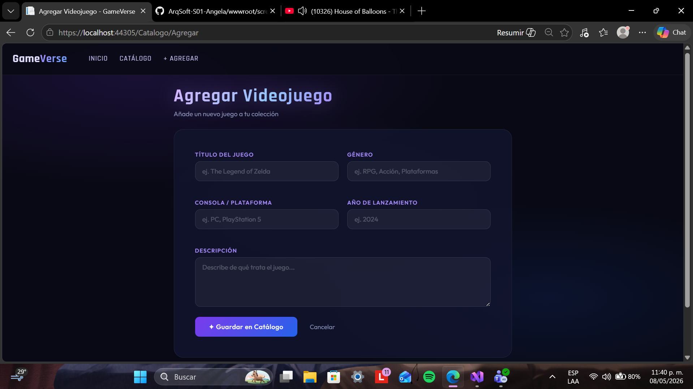

# Catalogo de videojuegos - GameVerse 

- **Nombre:** Ángela Yaritzi Rojas Brito
- **Institución:** Tecnologico de Software
- **Materia:** Arquitectura de Software
- **Profesor:** Jorge Javier Pedrozo Romero
- **Fecha:** Mayo 08, 2026

Este es un sitio para gestionar tu colección personal de videojuegos. Puedes navegar tu catálogo, ver detalles de cada juego y agregar nuevos títulos fácilmente.

## Funcionalidades

- Visualiza todos tus juegos organizados
- Filtra juegos por género
- Consulta información completa de cada juego (consola, año, descripción)
- Agrega nuevos juegos con un formulario simple

## Tecnologías usadas

- ASP.NET Core MVC
- C#
- HTML / CSS / JavaScript

## Capturas de pantalla

### Inicio

### Catálogo

### Detalle de videojuego

### Agregar videojuego

## Clausula de IA

En este proyecto existio el uso de IA, Claude AI. Claude ayudó en la creación de los estilos CSS personalizados, en el diseño visual del sitio web y en la escritura de parte del código JavaScript que hace que el sitio sea interactivo.
